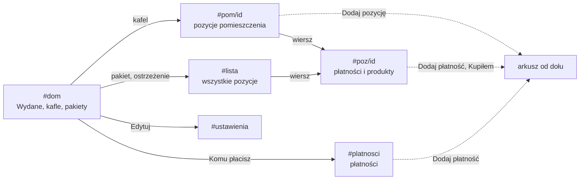

# System wyglądu: Koszty wykończenia domu

Aplikacja na telefon. Inspiracja: pastelowe karty z dużym zaokrągleniem, czarne pigułki, pływający czarny pasek (zdjęcie z Pinteresta). Główny pomysł to **„Farba”**: kolor pomieszczenia wypełnia jego kartę od dołu tak, jak wydawane są pieniądze. Pusta karta oznacza, że nic jeszcze nie wydano, a pełna, że plan jest wykorzystany. Wszystkie wartości są tokenami w `:root` w `index.html`. W regułach CSS nie wpisujemy kolorów ani rozmiarów na sztywno.

## Tokeny

### Kolory
| Token | Wartość | Do czego |
|---|---|---|
| `--tlo` | `#EFEFF3` | tło aplikacji (chłodna jasna szarość) |
| `--karta` | `#FFFFFF` | białe karty z listami, pola formularzy po fokusie |
| `--czern` | `#000000` | tekst, przyciski główne, pasek nawigacji |
| `--tekst-2` | `#55555C` | tekst pomocniczy na białym i na tle (7,4:1 i 6,5:1) |
| `--linia` | `#E4E4EB` | linie między wierszami |
| `--zolty`, `--lawenda` | `#F8DA6B`, `#C8C4F4` | budżet, aktywna ikona paska, farba domku; karta „Wydane” |
| `PASTELE` (app.js) | 10 kolorów | kolor pomieszczenia: farba kafli i kart, próbniki, kropki |
| `--zle`, `--zle-tlo`, `--zle-tekst` | `#C62F23`, `#FADAD6`, `#A3241A` | przekroczenia, błędy (plakietka 5,7:1) |
| `--ok`, `--ok-tlo` | `#1E7445`, `#D7F0E0` | zakończone, kupione, zapas |
| `--uwaga` | `#FBD2AE` | „poza planem” |
| `--tusz-2` | czerń 72% | podpisy na pastelach (min. 6,3:1 na farbie i ścianie) |
| `--domek-sciana` | `#F0EFFC` | ściana domku-wskaźnika i obwódka procentu |
| `--sz-ciemny`, `--sz-jasny` | `#E4E4EA`, `#F1F1F5` | szkielet ładowania |

Kolor pomieszczenia zapisany w bazie przechodzi przez `Logika.bezpiecznyKolor`: tylko `#RRGGBB`, inaczej pastel z palety.

**Odcienie farby** liczy `Logika.odcienie(kolor)` i podaje je elementowi jako zmienne `--sciana`, `--farba`, `--kreska`:
- `--farba` = kolor pomieszczenia,
- `--sciana` = kolor zmieszany z bielą w 57%,
- `--kreska` = kolor zmieszany z czernią w 27% (tylko obwódka pełnego próbnika).

Granicę farby tworzą dwa odcienie, bez kreski: Robert wybrał to w stroiku 5 paź 2026 (https://claude.ai/artifact/AY5TrcB2W1UhP1gCTtS5jD). Pastele są do siebie zbyt podobne, żeby same rozróżniały pomieszczenia, dlatego kolor nigdy nie niesie informacji sam: obok zawsze jest nazwa, ikona albo kwota.

### Pismo
- **Bricolage Grotesque** (700–800): liczby, tytuły, kwoty. Ciasny odstęp liter (−0,02em).
- **Plus Jakarta Sans** (400–700): cała reszta.
- Skala: `--t-xs` 12,5 · `--t-s` 13,5 · `--t-m` 15 · `--t-l` 17 · `--t-xl` 21 · `--t-2xl` 26 · `--t-3xl` 30 · `--t-hero` 42 px.
- Wyjątek: pola formularzy mają 16 px, bo przy mniejszej czcionce iPhone przybliża stronę.
- Kwoty: liczba dużą czcionką, „zł” jako `<small>` (0,62em). Cyfry równej szerokości.

### Kształty i odstępy
- Promienie: `--r-duzy` 28 (karty główne, arkusz), `--r-sredni` 22 (karty list, mini kafle), `--r-kafel` 21 (kafle pomieszczeń), `--r-maly` 16 (pola, próbniki, awatar). Przyciski i chipy to pełna pigułka (99px).
- Kolumna max 520 px, margines 16 px, odstęp między kaflami 12 px, nad sekcją 28 px.
- Każdy element do stuknięcia ma co najmniej 44×44 px.

## Komponenty
| Komponent | Klasa | Kiedy |
|---|---|---|
| Karta główna | `.hero` | jedna na ekran, najważniejsza liczba. Na Dom lawendowa z domkiem; na pomieszczeniu i pozycji `.farbowana` (farba w kolorze pomieszczenia) |
| Domek-wskaźnik | `.domek` (SVG) | tylko na Dom: kształt ikony aplikacji, napełniony żółtą farbą do procentu wydanego budżetu, procent w środku |
| Mini kafel | `.mini` | dwa obok siebie pod kartą główną (budżet, zostało do wydania) |
| Kafel pomieszczenia | `.kafel` | siatka 2 kolumny na Dom: ikona, nazwa, „zostało”, farba od dołu |
| Próbnik | `.probnik` | mały kwadrat 46 px przed nazwą pozycji i pakietu: ściana i farba; ✓ gdy zakończone lub plan wykorzystany, „!” gdy poza planem |
| Wiersz pozycji | `.poz` | próbnik, nazwa, pomieszczenie i kategoria, po prawej wydane i plan |
| Wiersz płatności | `.pl` | kropka w kolorze pomieszczenia, nazwa, kwota, data i komu |
| Karty „Komu płacisz” | `.wk-karta` | przewijany w bok rząd na Dom: inicjał w pastelowym kółku, nazwa, suma |
| Zakup domu | `.zakup` | biała karta na Dom: „Dom i formalności” z sumą, pod spodem pozycje |
| Chip | `.chip` (`.chip-szary`, `.chip-kontur`) | filtry (`aria-pressed`) i wybór w formularzu (`role=radio`); przy produkcie szary „Sklep” i obrysowany „Kupiłem” |
| Przycisk główny | `.btn-czarny` | jedna akcja na ekran: „Dodaj pozycję”, „Dodaj płatność”, „Zapisz” |
| Arkusz | `#arkusz` | wszystkie formularze, wysuwa się od dołu; `aria-labelledby` = tytuł, Tab krąży w środku, „wstecz” zamyka |
| Pasek nawigacji | `#nav` | 4 ikony, aktywna w żółtym kółku 52 px, `aria-current="page"`, bez „+” (decyzja Roberta) |
| Plakietka | `.tag` (`.ok`, `.zle`, `.uwaga`) | stan pozycji lub produktu |
| Szkielet | `.szkielet` | zamiast „Wczytywanie…”: szare bloki w kształcie ekranu głównego |

Pasków postępu nie ma (Robert: „nie pasują”). Postęp pokazuje farba.

## Ruch
Zasada: ruch odpowiada na działanie użytkownika albo na zmianę danych. Sam z siebie dzieje się tylko jeden moment: farba wznosi się przy pierwszym otwarciu ekranu głównego. Przy „Ogranicz ruch” w systemie wszystko jest wyłączone (`prefers-reduced-motion`).

| Token | Wartość | Użycie |
|---|---|---|
| `--ruch-klik` | 120 ms | wciśnięcie (scale .94–.985) |
| `--ruch-szybki` | 180 ms | zamykanie arkusza, zanik |
| `--ruch-sredni` | 300 ms | wjazd arkusza, przejścia ekranów, komunikat |
| `--ruch-wolny` | 900 ms | liczniki kwot |
| `--ruch-farba` | 0,95 s | wznoszenie farby w kaflach, kartach, próbnikach i domku |
| `--ruch-farba-odstep` | 50 ms | opóźnienie między kolejnymi kaflami |
| `--ruch-mieni` | 1,3 s | migotanie szkieletu |
| `--ease-wyjscie` | `cubic-bezier(.2,.8,.2,1)` | domyślna krzywa |
| `--ease-sprezyna` | `cubic-bezier(.34,1.56,.64,1)` | „podskok”: wznoszenie farby, komunikat, plakietka kupione |

Efekty:
1. **Przejście kafel → ekran** (View Transitions): kafel pomieszczenia zamienia się w kartę główną, wiersz pozycji w kartę pozycji. Nazwy przejść tylko z `Logika.nazwaPrzejscia`. Pominięte przejście (szybkie stuknięcia, obrót) jest ciche.
2. **Liczniki kwot** (`kwL` + `Logika.wartoscLicznika`): przy pierwszym otwarciu Dom kwoty nabijają się od zera, później tylko przy zmianie, od starej do nowej wartości. Ostatnie wartości są w `S.liczby`.
3. **Farba się wznosi** (`farbaEl`, `domek`): przy pierwszym otwarciu Dom od zera, później tylko przy zmianie, od poprzedniego poziomu. Poziomy są w `S.farby`, osobno od kwot.
4. **Wciśnięcia** na kaflach, wierszach, przyciskach i chipach.
5. **Arkusz** wjeżdża i zjeżdża, a zasłona płynnie się pojawia i znika.
6. **Komunikat sukcesu** wskakuje od góry z żółtym ptaszkiem.
7. **„kupione”** podskakuje, gdy produkt właśnie dostał płatność.

## Specyfikacja „Farby”

### Przegląd
Robert otwiera aplikację na telefonie i jednym spojrzeniem widzi, ile wydał w każdym pomieszczeniu. Liczby są zawsze napisane, a farba pozwala ocenić stan bez czytania.

### Poziom farby
- `Logika.poziomFarby(wydane, plan)` = wydane / plan w %, zaokrąglone, najwyżej 100.
- Bez planu: 100, gdy coś wydano; 0, gdy nic.
- Podpisy pokazują prawdziwy procent z `Logika.procent` (może przekroczyć 100), farba nigdy nie wychodzi poza kartę.

### Elementy
| Element | Wymiary | Farba | Kreska | Tekst |
|---|---|---|---|---|
| Kafel `.kafel` | min. wys. 164 px, padding 14/14/16, `--r-kafel` | od dołu, `height: N%` | brak | góra: ikona, nazwa, kwota „zostało”, podpis |
| Karta pomieszczenia `.hero.farbowana` | min. wys. 196 px, `--r-duzy` | od dołu | brak | kwota u góry, podpis „wydane X z Y (P%)” na dole |
| Karta pozycji `.hero-poz` | padding dołu 60 px na podpis | od dołu | brak | trzy liczby u góry, „wydane P% planu” przyklejone do dołu |
| Próbnik `.probnik` | 46×46 px, `--r-maly` | od dołu | brak | brak |
| Domek `.domek` | 104×104 px, viewBox 100 | żółta, od y=88 w górę do 71 jednostek | brak | procent 19 px z obwódką w kolorze ściany |

### Stany próbnika
| Stan | Warunek | Wygląd |
|---|---|---|
| Poziom | jest plan, wydane < plan | ściana + farba do N% |
| Pusty | jest plan, nic nie wydano | sama ściana |
| Pełny | zakończone albo wydane ≥ plan | cały w farbie, obwódka 2 px `--kreska`, ✓ |
| Poza planem | poza pakietem: wydane > plan albo wydane bez planu | `--uwaga` z „!” |
| Pakiet bez planu | pozycja w pakiecie bez własnego planu | pełna farba (budżet liczy pakiet) |
| Zakup domu | pozycja zakupu | odcienie neutralne `--neutralny` |

### Podpisy
| Miejsce | Brak pozycji | Bez planu | W planie | Ponad plan |
|---|---|---|---|---|
| Kafel | „brak pozycji” | „bez planu” | „zostało z X” | „ponad plan o X” |
| Karta pomieszczenia | „brak pozycji” | „wydane X, bez planu” | „wydane X z Y (P%)” | „wydane X z Y (P%)”, P > 100 |
| Karta pozycji | – | brak podpisu | „wydane P% planu” | „wydane P% planu”, P > 100 |

### Ruch
| Element | Kiedy | Animacja | Czas | Krzywa |
|---|---|---|---|---|
| Farba kafli | pierwsze otwarcie Dom; zmiana danych | `height` od poprzedniego poziomu (`--od`) | `--ruch-farba`, kolejne kafle co `--ruch-farba-odstep` | `--ease-sprezyna` (lekko przeskakuje i osiada) |
| Farba kart i próbników | zmiana danych | jak wyżej, bez opóźnienia | `--ruch-farba` | `--ease-sprezyna` |
| Farba domku | pierwsze otwarcie Dom; zmiana budżetu lub wydatków | `translateY` od poprzedniego poziomu (`--od-dy`) | `--ruch-farba` | `--ease-sprezyna` |
| Szkielet | czekanie na dane | przesuwany połysk | `--ruch-mieni`, w pętli | liniowa |

Powrót na ekran bez zmiany danych nie uruchamia żadnej animacji.

### Przypadki brzegowe
- **Wolne łącze**: szkielet w kształcie ekranu głównego, potem dane.
- **Błąd wczytania**: zamiast szkieletu komunikat z błędem.
- **Długa nazwa pomieszczenia**: zawija się (`overflow-wrap: anywhere`), kwota nigdy się nie łamie.
- **Kolor spoza palety lub uszkodzony w bazie**: `bezpiecznyKolor` odrzuca, pomieszczenie dostaje pastel z palety, pozycja bez pomieszczenia dostaje odcienie neutralne.
- **Brak danych w kwotach**: farba ma wysokość 0, nic się nie psuje.

### Dostępność
- Farba i próbniki są tylko wizualne (`aria-hidden`). Te same informacje są w tekście obok: kwota, „z X”, „ponad plan o X”, „zakończone”.
- Domek to `role="img"` z nazwą „Wydane N% budżetu”.
- Szkielet to `role="status"` z ukrytym tekstem „Wczytywanie danych…”.
- Tekst na farbie i ścianie: czerń albo `--tusz-2`, kontrast co najmniej 6,3:1 dla wszystkich pasteli.
- Kolejność fokusu na Dom: karta „Wydane” (bez fokusu), budżet, ostrzeżenie, kafle w kolejności pomieszczeń, pakiety, „Komu płacisz”, zakup domu, pasek nawigacji.

## Ekrany i przejścia

## Teksty
Jedno pojęcie, jedna nazwa:
- **Wydane** (nigdy „Zapłacone”)
- **Zostało** / **Zostało do wydania**
- **Plan**, **Pozycja**, **Komu**, **Paragon**
- Przycisk przy produkcie: **Kupiłem**; plakietka: **kupione**
- Potwierdzenie usunięcia: **Tak, usuń**
- Powitanie na Dom: „Dzień dobry” (5:00–17:59) albo „Dobry wieczór”, bez daty

Komunikaty: „Dodano płatność: Dywan, 1 899,00 zł”. Błędy mówią, co zrobić: „Wpisz kwotę, np. 1250,50.” Na telefonie piszemy „dotknij”, nie „kliknij”.

## Bezpieczeństwo w HTML
Wszystko, co pochodzi z bazy (nazwy, id, opisy, linki), przechodzi przez `esc()` przed wstawieniem do HTML. Kolor przechodzi przez `bezpiecznyKolor`, a odcienie farby liczy `odcienie` tylko z bezpiecznego koloru. Nazwy przejść idą przez `nazwaPrzejscia`. Linki produktów muszą zaczynać się od `http(s)://`. Testy: `node --test testy/*.test.js`.
